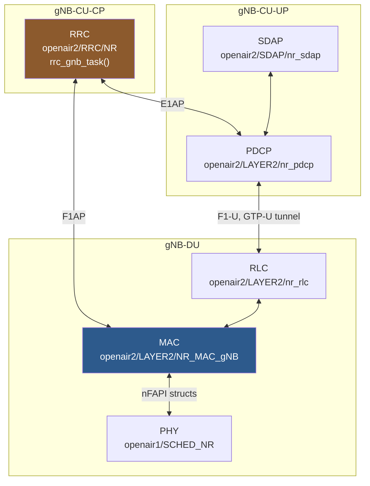
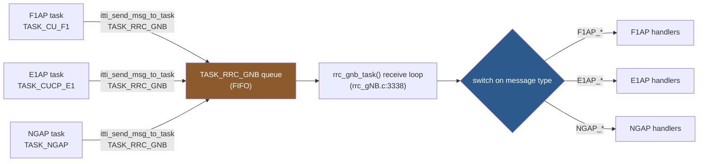
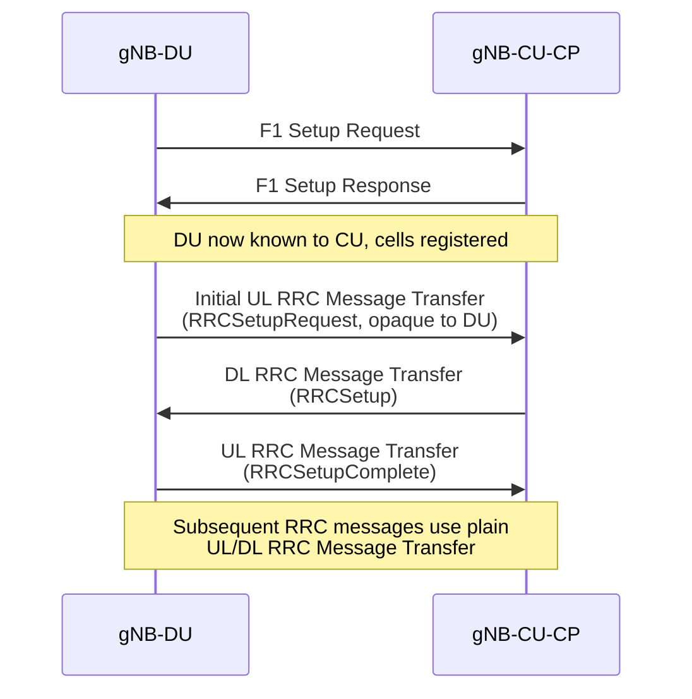
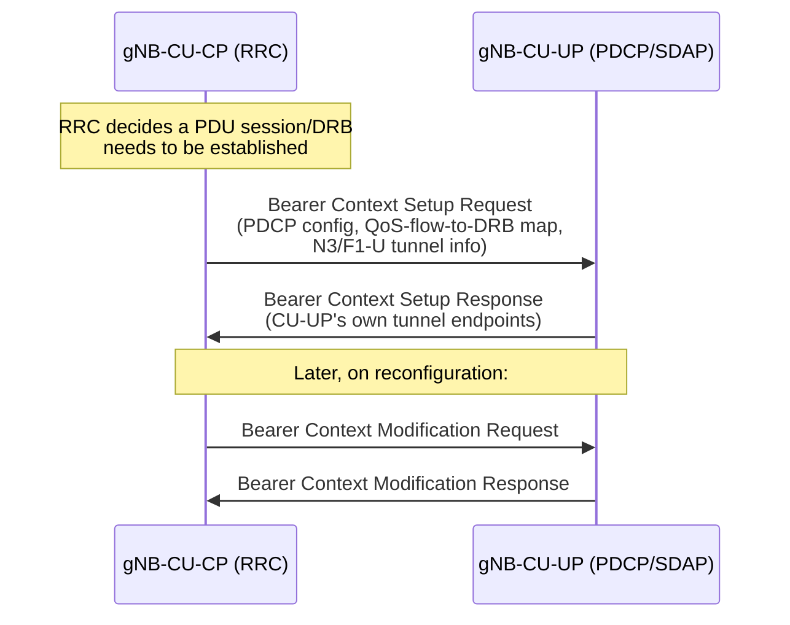
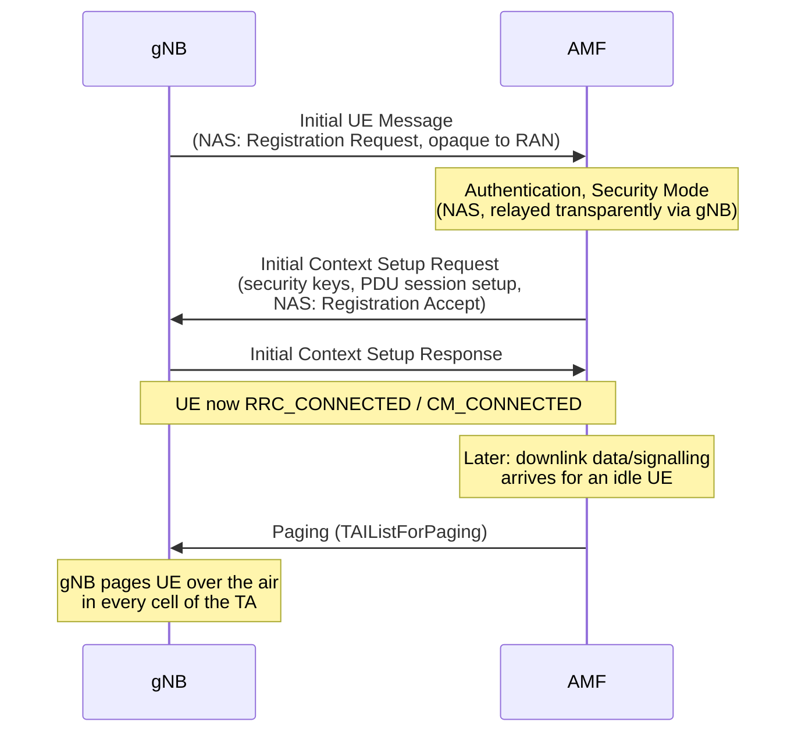
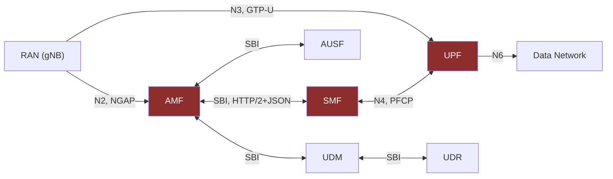
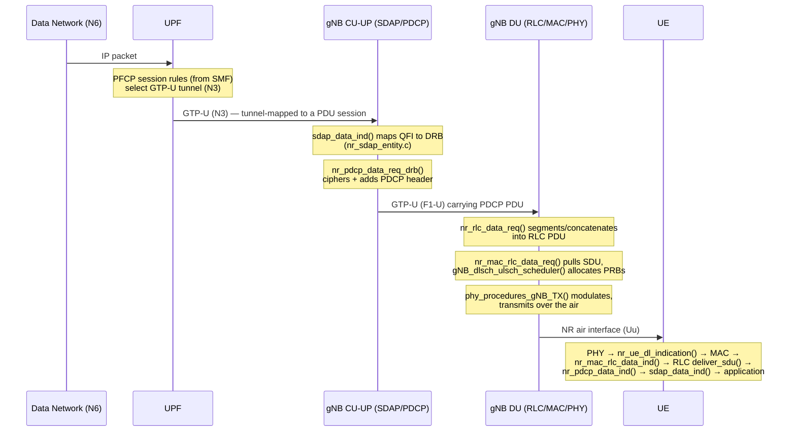

# How the OAI Stack Layers Fit Together

**Date:** 2026-07-14
**Project:** OAI_STANDARD_SETUP
**Scope:** `OAI_RAN_code/openairinterface5g` (gNB/UE protocol stack) and `OAI_CN_code/oai-cn5g-*` (5G core)
**Method:** Every file path, function name, and struct name below was grep-confirmed live against the
two repos in this workspace this session (not recalled from training data). Background context drawn
from 3GPP specifications is explicitly labeled "Background" and cited; anything not labeled is a
repo-verified fact.

---

## Table of Contents
1. [Overview](#1-overview)
2. [The RAN Protocol Stack](#2-the-ran-protocol-stack)
   - 2.1 [PHY](#21-phy)
   - 2.2 [MAC](#22-mac)
   - 2.3 [RLC](#23-rlc)
   - 2.4 [PDCP](#24-pdcp)
   - 2.5 [SDAP](#25-sdap)
   - 2.6 [RRC](#26-rrc)
3. [ITTI — the Glue Between Everything](#3-itti--the-glue-between-everything)
4. [F1AP — CU↔DU Interface](#4-f1ap--cudu-interface)
5. [E1AP — CU-CP↔CU-UP Interface](#5-e1ap--cu-cpcu-up-interface)
6. [NGAP — RAN↔AMF Interface](#6-ngap--ranamf-interface)
7. [The 5G Core: AMF, SMF, UPF](#7-the-5g-core-amf-smf-upf)
8. [Full Picture: One User-Plane Packet, Top to Bottom](#8-full-picture-one-user-plane-packet-top-to-bottom)
9. [Cross-Layer Reference Table](#9-cross-layer-reference-table)
10. [Sources](#10-sources)

---

## 1. Overview

OAI splits a 5G Standalone (SA) deployment into two independently-built code trees in this workspace:

- **`OAI_RAN_code/openairinterface5g`** builds every RAN-side executable from one repo: the gNB
  (monolithic, or split into CU-CP/CU-UP/DU), and the UE. Layer code lives under `openair1/`
  (PHY) and `openair2/`+`openair3/` (MAC/RLC/PDCP/SDAP/RRC and the F1AP/E1AP/NGAP interfaces).
- **`OAI_CN_code/oai-cn5g-*`** is a family of separate repos, one per 5G Core network function
  (AMF, SMF, UPF, NRF, AUSF, UDM, UDR, ...), each depending on a shared `oai-cn5g-common-src`
  library for wire-format codecs (NAS, NGAP) and `oai-cn5g-common-build` for shared build tooling —
  this workspace-specific detail was already load-bearing in an earlier finding this session
  (`docs/research/oai-ue-power-saving-implementation.md` §3.3: the MICO NAS codec lives in
  `common-src`, not in `oai-cn5g-amf` itself).

Both trees glue their internal modules together with the same architectural idea — a message-queue
framework called **ITTI** (Intra-Task/Thread Interface) — but two *different, independent
implementations* of it: RAN's is `common/utils/ocp_itti`, AMF's is its own `src/itti`. They are not
the same code; the RAN ITTI and the CN ITTI never exchange ITTI messages directly with each other —
NGAP is the only thing that crosses that boundary, and it does so as an encoded ASN.1 PDU over SCTP,
not as a shared in-memory message type.

---

## 2. The RAN Protocol Stack

The NR user-plane/control-plane stack, per 3GPP TS 38.300 §4.4 (Background: the layer list and its
general division of labor is standardized; OAI's directory/function mapping onto it is
workspace-specific and repo-verified below).

### 2.1 PHY

- **Directory:** `openair1/PHY` (signal-processing library); the per-slot orchestration lives in the
  sibling directories `openair1/SCHED_NR` (gNB) and `openair1/SCHED_NR_UE` (UE).
- **Key files:** `openair1/SCHED_NR/phy_procedures_nr_gNB.c`, `openair1/SCHED_NR_UE/phy_procedures_nr_ue.c`,
  `openair2/NR_PHY_INTERFACE/NR_IF_Module.c/.h` (gNB PHY↔MAC glue), `openair2/NR_UE_PHY_INTERFACE/NR_IF_Module.h` (UE PHY↔MAC glue).
- **Key functions:**
  - `void phy_procedures_gNB_TX(PHY_VARS_gNB *gNB, ...)` — `phy_procedures_nr_gNB.c:239`
  - `int phy_procedures_gNB_uespec_RX(PHY_VARS_gNB *gNB, int frame_rx, int slot_rx, NR_UL_IND_t *UL_INFO)` — `phy_procedures_nr_gNB.c:1008`
  - `void phy_procedures_nrUE_TX(...)` — `phy_procedures_nr_ue.c:367`; UE RX split into
    `pdcch_processing()` (1020), `pbch_processing()` (1063), `pdsch_processing()` (1223), feeding
    `nr_fill_dl_indication()` (84), all in `phy_procedures_nr_ue.c`.
- **Boundary to MAC:** the gNB PHY thread calls `NR_UL_indication()` in `NR_IF_Module.c`, passing an
  `NR_UL_IND_t*`, which invokes `gNB_dlsch_ulsch_scheduler()` (§2.2). The UE PHY thread invokes a
  registered callback `ue->if_inst->dl_indication(&dl_indication)` (`phy_procedures_nr_ue.c:936`)
  carrying an `nr_downlink_indication_t*` (typed per `NR_UE_PHY_INTERFACE/NR_IF_Module.h:242`).
- **Background:** TS 38.300 §4.4.1 defines the PHY layer's role (channel coding, modulation, MIMO,
  HARQ soft-combining) — OAI's split of this into a "library" (`openair1/PHY`) called by real-time
  scheduling code (`SCHED_NR*`) is an implementation choice, not a spec requirement.

### 2.2 MAC

**gNB side** (`openair2/LAYER2/NR_MAC_gNB`):
- **Key files:** `gNB_scheduler.c`, `gNB_scheduler_dlsch.c`, `gNB_scheduler_ulsch.c`,
  `mac_rrc_dl_handler.c`, `mac_rrc_ul_f1ap.c` / `mac_rrc_ul_direct.c`, `mac_proto.h`.
- **Scheduler entry:** `void gNB_dlsch_ulsch_scheduler(module_id_t module_idP, frame_t frame, slot_t slot, NR_Sched_Rsp_t *sched_info)`
  — `gNB_scheduler.c:146` (declared `mac_proto.h:74`), called from `NR_IF_Module.c:395`.
- **MAC↔PHY struct:** `NR_Sched_Rsp_t` (`NR_IF_Module.h:87-104`) bundles the nFAPI structs
  `nfapi_nr_dl_tti_request_t`, `nfapi_nr_ul_tti_request_t`, `nfapi_nr_ul_dci_request_t`,
  `nfapi_nr_tx_data_request_t` (defined in `nfapi/open-nFAPI/nfapi/public_inc/nfapi_interface.h`).
- **MAC↔RLC:** `nr_mac_rlc_data_req()` (MAC pulls a DL SDU from RLC, e.g. called at
  `gNB_scheduler_RA.c:1870`, defined `openair2/LAYER2/nr_rlc/nr_rlc_oai_api.c:238`) and
  `nr_mac_rlc_data_ind()` (MAC pushes a received UL PDU up to RLC, called at
  `gNB_scheduler_ulsch.c:645`, defined `nr_rlc_oai_api.c:163`).
- **MAC↔RRC:** `mac_rrc_dl_handler.c` (RRC config pushed down into MAC) and `mac_rrc_ul_f1ap.c`
  (UL CCCH/DCCH SDUs sent up to RRC via F1AP when CU/DU split) or `mac_rrc_ul_direct.c` (monolithic
  build, direct function call instead of F1AP).

**UE side** (`openair2/LAYER2/NR_MAC_UE`):
- **Key files:** `nr_ue_scheduler.c`, `nr_ue_procedures.c`, `nr_ra_procedures.c`, `mac_defs.h`, `mac_proto.h`.
- **PHY→MAC entry:** `int nr_ue_dl_indication(nr_downlink_indication_t *dl_info)` and
  `int nr_ue_ul_indication(nr_uplink_indication_t *ul_info)` (`NR_UE_PHY_INTERFACE/NR_IF_Module.h:287,289`).
- **MAC↔RLC:** same `nr_mac_rlc_data_req()`/`nr_mac_rlc_data_ind()` pair, called from
  `nr_ue_scheduler.c:2318`/`nr_ra_procedures.c:1065` (TX) and `nr_ue_procedures.c:4141` (RX).
- **Background:** TS 38.321 defines MAC's responsibilities (scheduling, HARQ, logical-channel
  multiplexing, RA procedure) — the DRX section of this workspace's earlier power-saving report
  (`docs/research/oai-ue-power-saving-implementation.md` §3.1) lives entirely inside this layer.

### 2.3 RLC

- **Directory:** `openair2/LAYER2/nr_rlc` — the active NR implementation (two other directories,
  `openair2/LAYER2/RLC` — legacy LTE — and `openair2/LAYER2/rlc_v2` — an alternate/experimental
  implementation — also exist in the tree but are not what the top-level `CMakeLists.txt` builds
  for NR).
- **Key files:** `nr_rlc_entity.c/.h` (common entity + AM/UM/TM dispatch), `nr_rlc_entity_am.c/.h`,
  `nr_rlc_entity_um.c/.h`, `nr_rlc_entity_tm.c/.h`, `nr_rlc_oai_api.c/.h` (OAI-facing glue),
  `nr_rlc_ue_manager.c/.h`.
- **Down from PDCP:** `rlc_op_status_t nr_rlc_data_req(const protocol_ctxt_t *ctxt_pP, ...)` —
  `nr_rlc_oai_api.c:311`.
- **Up to PDCP:** `static void deliver_sdu(void *_ue, nr_rlc_entity_t *entity, char *buf, int size)` —
  `nr_rlc_oai_api.c:424`, calling `nr_pdcp_data_ind(&ctx, is_srb, rb_id, size, memblock)` at line 520;
  registered as a function pointer `entity->deliver_sdu` (`nr_rlc_entity.h:122-123`).
- **Background:** TS 38.322 defines RLC's 3 modes (TM/UM/AM) — AM adds ARQ retransmission, UM
  provides in-sequence delivery without retransmission, TM is used only for specific SRB0/BCCH/PCCH
  traffic. `doc/SW_archi.md` in the RAN repo notes RLC is architecturally unusual in OAI: it is *not*
  its own ITTI-threaded task — it's a library invoked directly from whichever thread calls into it
  (RRC thread, PHY threads, PDCP thread, F1 threads), synchronized around a shared
  `nr_rlc_ue_manager`.

### 2.4 PDCP

- **Directory:** `openair2/LAYER2/nr_pdcp` (legacy LTE PDCP is the separate `PDCP_v10.1.0` directory).
- **Key files:** `nr_pdcp_entity.c/.h` (per-bearer entity + security state), `nr_pdcp_oai_api.c/.h`,
  `nr_pdcp_security_nea1.c`/`nea2.c` (ciphering), `nr_pdcp_integrity_nia1.c`/`nia2.c` (integrity),
  `nr_pdcp_ue_manager.c/.h`.
- **Down (from SDAP/RRC, toward RLC):** `bool nr_pdcp_data_req_srb(...)` — `nr_pdcp_oai_api.c:741`;
  `bool nr_pdcp_data_req_drb(protocol_ctxt_t *ctxt_pP, ...)` — `nr_pdcp_oai_api.c:917`.
- **Up (from RLC, toward SDAP):** `bool nr_pdcp_data_ind(const protocol_ctxt_t *ctxt_pP, ...)` —
  `nr_pdcp_oai_api.c:353`, the function RLC's `deliver_sdu` calls into (§2.3).
- **Background:** TS 38.323 assigns PDCP: header compression (optional), ciphering, integrity
  protection, in-sequence delivery/duplicate detection, and (on handover) PDCP-SN-based
  retransmission. OAI implements NEA1/NEA2 ciphering and NIA1/NIA2 integrity algorithms as separate
  source files selected per the bearer's configured security algorithm.

### 2.5 SDAP

- **Directory:** `openair2/SDAP/nr_sdap` — confirmed as a genuinely separate module (not folded into
  PDCP, unlike some non-OAI implementations).
- **Key files:** `nr_sdap.c` (session/API layer), `nr_sdap_entity.c/.h` (per-entity QoS-flow logic),
  `nr_sdap_configuration.h`.
- **Down (toward PDCP):** `bool sdap_data_req(protocol_ctxt_t *ctxt_p, ...)` — `nr_sdap.c:47`.
- **Up (from PDCP):** `void sdap_data_ind(int pdcp_entity, ...)` — `nr_sdap.c:83`, called from PDCP's
  `deliver_sdu_drb`.
- **QFI→DRB mapping:** `entity->qfi2drb_map(entity, qfi)` / `entity->qfi2drb_table[qfi]` —
  `nr_sdap_entity.c:105-110`; header struct `nr_sdap_ul_hdr_t` carries the `.QFI` field
  (`nr_sdap_entity.c:77`).
- **Background:** TS 37.324 (SDAP is common to NR access, spec numbered in the 37-series) defines
  SDAP's single job: map QoS Flows (identified by QFI, assigned by the 5GC's PCF/SMF policy) onto
  Data Radio Bearers (DRBs) the RAN actually schedules — this is the layer that turns 5GC-level QoS
  policy into RAN-level radio bearer selection.

### 2.6 RRC

- **gNB:** `openair2/RRC/NR`. Confirmed entry: `void *rrc_gnb_task(void *args_p)` —
  `openair2/RRC/NR/rrc_gNB.c:3338`. Per `doc/RRC/rrc-dev.md`, this is the ITTI-loop dispatcher: a
  single-threaded, FIFO message consumer with one big `switch` over three message-name families —
  `NGAP_*`, `F1AP_*`, `E1AP_*`.
- **UE:** `openair2/RRC/NR_UE`. Confirmed entry: `void *rrc_nrue_task(void *args_p)` —
  `openair2/RRC/NR_UE/rrc_UE.c:3092`.
- **Core data structures** (per `doc/RRC/rrc-dev.md`): `nr_rrc_du_container_t` (DUs, keyed by SCTP
  `assoc_id` in a red-black tree), `nr_rrc_cell_container_t` (cells, both a global tree keyed by
  `cell_id` and a per-DU array), `gNB_RRC_UE_t` (per-UE state: serving cells — 1 PCell + up to 31
  SCells — security context, SRB/DRB bearers, PDU sessions, handover context), `nr_rrc_cuup_container_t`
  (CU-UP tracking, keyed by E1 `assoc_id`).
- **Background:** TS 38.331 defines RRC's job: broadcast system information (SIB1/SIB2/...),
  establish/reconfigure/release the radio connection, and carry non-3GPP-access-stratum (NAS)
  messages transparently between UE and core. Nearly every mechanism in this workspace's power-saving
  report (`docs/research/oai-ue-power-saving-implementation.md`) is an RRC IE (DRX-Config,
  DormantBWP-Config, ReleasePreference, relaxedMeasurement) — RRC is the layer where "what power
  state should the UE be in" gets negotiated, even though PHY/MAC is where the power is actually
  saved or not.

---

## 3. ITTI — the Glue Between Everything

**Directory:** `common/utils/ocp_itti` (RAN repo only — the CN's AMF has its own separate, smaller
ITTI implementation at `oai-cn5g-amf/src/itti`, not the same code).

- **Key files:** `intertask_interface.h` (task-ID enum + send/receive API), `intertask_interface.cpp`,
  `all_msg.h`.
- **Task IDs:** defined via a `FOREACH_TASK` X-macro at `intertask_interface.h:280-324`, producing
  the `task_id_t` enum. Confirmed entries relevant to this document: `TASK_RRC_GNB` (294),
  `TASK_RRC_NRUE` (315), `TASK_CU_F1`/`TASK_DU_F1` (319-320), `TASK_CUCP_E1`/`TASK_CUUP_E1` (321-322),
  `TASK_NGAP` (297), plus `TASK_MAC_GNB`, `TASK_MAC_UE`, `TASK_RLC_ENB`/`TASK_RLC_UE`,
  `TASK_PDCP_GNB`/`TASK_PDCP_UE`, `TASK_GTPV1_U`, `TASK_SCTP`.
- **Routing API:** `int itti_send_msg_to_task(task_id_t task_id, instance_t instance, MessageDef *message)`
  (`intertask_interface.h:436`); receive side `void itti_receive_msg(task_id_t task_id, MessageDef **received_msg)` (466).
- **Concrete example (F1AP → RRC):** `openair2/F1AP/f1ap_cu_rrc_message_transfer.c:61`, after decoding
  an incoming `F1AP_UL_RRC_MESSAGE` PDU, calls `itti_send_msg_to_task(TASK_RRC_GNB, instance, message_p)`.
  The message then sits in `TASK_RRC_GNB`'s queue until `rrc_gnb_task()`'s next receive-loop
  iteration picks it up and dispatches it through the big switch (§2.6).

**What this means architecturally:** no RAN module calls another module's function directly across a
task boundary (only *within* a task, e.g. MAC calling `nr_mac_rlc_data_req()` directly, is a plain
function call — RLC is a library, not its own task, per §2.3). Everything that crosses a *task*
boundary — F1AP↔RRC, E1AP↔RRC, NGAP↔RRC, SCTP↔F1AP/E1AP/NGAP — goes through
`itti_send_msg_to_task()`. This is why `doc/RRC/rrc-dev.md` can accurately describe RRC as "basically
an ITTI message queue with associated handlers": from RRC's point of view, F1AP, E1AP, and NGAP are
indistinguishable from any other message source — they're just enum tags in the same switch
statement.

---

## 4. F1AP — CU↔DU Interface

**Directory:** `openair2/F1AP`. **Background:** TS 38.470 (general F1 description) / TS 38.473
(F1AP message definitions) specify this interface between a gNB-CU and gNB-DU.

- **Key files:** `f1ap_encoder.c` (ASN.1 PER encode), `f1ap_cu_task.c` / `f1ap_du_task.c` (ITTI task
  loops, one per side), `f1ap_cu_rrc_message_transfer.c` / `f1ap_du_rrc_message_transfer.c`,
  `f1ap_cu_interface_management.c` / `f1ap_du_interface_management.c`.
- **Encode entry:** `int f1ap_encode_pdu(F1AP_F1AP_PDU_t *pdu, uint8_t **buffer, uint32_t *length)` —
  `f1ap_encoder.c:31`.
- **Confirmed message types and their handler functions:**

| Message | Direction | Function | File:line |
|---|---|---|---|
| F1 Setup Request | DU→CU | `DU_send_F1_SETUP_REQUEST(...)` | `f1ap_du_interface_management.c:142` |
| F1 Setup Response | CU→DU | `CU_send_F1_SETUP_RESPONSE(...)` | `f1ap_cu_interface_management.c:117` |
| DL RRC Message Transfer | CU→DU | `CU_send_DL_RRC_MESSAGE_TRANSFER(...)` | `f1ap_cu_rrc_message_transfer.c:69` |
| DL RRC Message Transfer (recv) | at DU | `DU_handle_DL_RRC_MESSAGE_TRANSFER(...)` | `f1ap_du_rrc_message_transfer.c:58` |
| UL RRC Message Transfer (recv) | at CU | `CU_handle_UL_RRC_MESSAGE_TRANSFER(...)` | `f1ap_cu_rrc_message_transfer.c:97` |
| Initial UL RRC Message Transfer (recv) | at CU | `CU_handle_INITIAL_UL_RRC_MESSAGE_TRANSFER(...)` | `f1ap_cu_rrc_message_transfer.c:48` |
| Initial UL RRC Message Transfer | DU→CU | `DU_send_INITIAL_UL_RRC_MESSAGE_TRANSFER(...)` | `f1ap_du_rrc_message_transfer.c:74` |

- **What crosses the boundary:** encapsulated RRC PDUs (the DU never parses RRC content — it's an
  opaque octet string as far as F1AP/DU are concerned), plus UE-context and cell/DU-management
  control messages, all over SCTP. `doc/RRC/rrc-dev.md` documents the RRC Reestablishment procedure
  specifically relying on F1AP to transparently forward a `CellGroupConfig` from the old to the new
  DU per TS 38.473's reestablishment provisions.

---

## 5. E1AP — CU-CP↔CU-UP Interface

**Directory:** `openair2/E1AP`. **Background:** TS 37.483 specifies this interface between a
gNB-CU-CP and gNB-CU-UP.

- **Key files:** `e1ap.c` (task-level handling), `e1ap_setup.c`, `lib/e1ap_bearer_context_management.c`,
  `lib/e1ap_interface_management.c`.
- **Confirmed message types (Bearer Context Setup family):**
  - `bool decode_E1_bearer_context_setup_request(...)` — `lib/e1ap_bearer_context_management.c:658`
  - `bool decode_E1_bearer_context_setup_response(...)` — line 968
  - `bool decode_E1_bearer_context_setup_failure(...)` — line 1162
  - `void free_e1_bearer_context_setup_failure(...)` — line 1220
- **Also referenced in `doc/RRC/rrc-dev.md`'s sequence diagrams:** "E1AP Bearer Context Setup
  Req/Resp" and "E1AP Bearer Context Modification Req/Resp," exchanged between CU-CP's
  `rrc_gNB_process_e1_bearer_context_setup_resp()` and the CU-UP side.
- **What crosses the boundary:** PDCP/SDAP configuration and QoS-flow-to-DRB mapping instructions
  (i.e., everything CU-CP's RRC decided that CU-UP's PDCP/SDAP instance needs to apply), plus
  GTP-U tunnel endpoint information for the N3 (UPF-facing) and F1-U (DU-facing) tunnels that
  CU-UP terminates. CU-UP-side handling lives in `openair2/LAYER2/nr_pdcp/cucp_cuup_handler.c` and
  `cuup_cucp_e1ap.c`.

---

## 6. NGAP — RAN↔AMF Interface

**Directory:** `openair3/NGAP` (RAN side). **Background:** TS 38.410 (general NG description) /
TS 38.413 (NGAP message definitions) specify this interface between a gNB and an AMF.

- **Key files:** `ngap_gNB.c` (task loop / dispatch switch), `ngap_gNB_nas_procedures.c`,
  `ngap_gNB_context_management_procedures.c`, `ngap_gNB_paging.c`, `ngap_gNB_encoder.c` /
  `ngap_gNB_decoder.c`.
- **Confirmed message types:**
  - **Initial UE Message:** `int ngap_gNB_handle_nas_first_req(instance_t instance, ngap_nas_first_req_t *UEfirstReq)`
    — `ngap_gNB_nas_procedures.c:154`, invoked from the dispatch switch at `ngap_gNB.c:600`.
  - **Initial Context Setup:** `int ngap_gNB_initial_ctxt_resp(instance_t instance, ngap_initial_context_setup_resp_t *initial_ctxt_resp_p)`
    — `ngap_gNB_nas_procedures.c:562`; dispatch cases `NGAP_INITIAL_CONTEXT_SETUP_RESP`/`_FAIL` at
    `ngap_gNB.c:612-617`.
  - **Paging:** `openair3/NGAP/ngap_gNB_paging.c`, handling the `TAIListForPaging` IE (line 181).
- **What crosses the boundary:** NAS PDUs (opaque to the RAN — NGAP/RRC never parse NAS content,
  they just relay the octet string between UE and AMF), plus RAN-visible context/bearer/mobility
  control messages (Initial Context Setup carries security keys + PDU session setup instructions
  down to the RAN; Paging carries the AMF's request to page an idle UE). This is the same NGAP
  Paging path this workspace's MICO proof-of-concept (`poc-mico` branch, see
  `docs/research/oai-power-saving-poc-changelog.md` §1.6/§2.7) targets on the AMF side.
- **CN-side counterpart:** `oai-cn5g-amf/src/ngap` is thin (`ngap_app.cpp`/`.hpp` — task glue only);
  the actual NGAP ASN.1 message codec (`InitialContextSetupRequest`, `MicoModeIndication`, etc.)
  lives in the shared `oai-cn5g-common-src/ngap` library, confirmed by directory listing
  (`libngap`, `libngap_ies`, `ngap_ies`, `ngap_msgs`) — the same "codec lives in common-src, app
  logic lives in the per-NF repo" pattern already documented for the NAS layer in
  `docs/research/oai-ue-power-saving-implementation.md` §3.3.

---

## 7. The 5G Core: AMF, SMF, UPF

**Directory root:** `OAI_CN_code/` — one repo per network function.

- **AMF** (`oai-cn5g-amf/src`): `amf-app` (application logic — registration, mobility, N1/N2
  handling), `ngap` (thin task glue, codec in `common-src`), `nas` (thin — same pattern, real NAS
  codec in `common-src/nas`), `sbi` (HTTP2/JSON service-based interface client/server), `itti`
  (AMF's own, separate ITTI: confirmed task IDs `TASK_AMF_N2`, `TASK_AMF_N1`, `TASK_AMF_APP` at
  `itti_msg.hpp:35-37`), `contexts` (`nas_context`, `ue_context` — see the MICO proof-of-concept's
  use of `nas_context::mico_allowed` and `cm_state_t`), `sctp` (NGAP transport), `secu_algorithms`.
- **SMF** (`oai-cn5g-smf/src`): `smf_app` (session management logic), `nas` (session-management NAS
  messages), `ngap` (present in this repo too — SMF needs some NGAP visibility for PDU session
  resource setup relayed via AMF), `pfcp` (talks to UPF), `itti`, `udp`.
- **UPF** (`oai-cn5g-upf/src`): `upf_app`, `pfcp` (talks to SMF), `gtpv1u` (talks to RAN/UE for user
  data), `udp`.
- **Interfaces (background, TS-defined):**
  - **AMF↔SMF, AMF↔AUSF, AMF↔UDM, etc.:** Service-Based Interface (SBI), HTTP/2 + JSON, per
    TS 29.500 (framework) and per-NF service specs (e.g. TS 29.502 for SMF services, TS 29.518 for
    AMF services) — visible in the `sbi` directory in each CN repo.
  - **SMF↔UPF:** PFCP (Packet Forwarding Control Protocol), TS 29.244 — visible as the `pfcp`
    directory in both `oai-cn5g-smf` and `oai-cn5g-upf`.
  - **UPF↔RAN (N3) / UPF↔UE data plane:** GTP-U, TS 29.281 — visible as `gtpv1u` in
    `oai-cn5g-upf`, and as the RAN-side GTP task described in `doc/SW_archi.md` (`TASK_GTPV1_U`,
    calling `nr_pdcp_data_req_drb()` directly per §2.4).

---

## 8. Full Picture: One User-Plane Packet, Top to Bottom

Downlink user data, from the UPF's N6 (data-network-facing) interface to the UE's air interface,
per `doc/SW_archi.md`'s traced call chain (repo-verified function names) plus the CN-side hop
(background, standard GTP-U/PFCP behavior — not independently re-traced through UPF source this
session):

---

## 9. Cross-Layer Reference Table

| Layer/Interface | Repo location | Spec (background) | Crosses to neighbor via |
|---|---|---|---|
| PHY | `openair1/SCHED_NR*`, `openair1/PHY` | TS 38.201/38.211-214 | nFAPI structs (`NR_Sched_Rsp_t`, `NR_UL_IND_t`) |
| MAC | `openair2/LAYER2/NR_MAC_gNB`, `NR_MAC_UE` | TS 38.321 | `nr_mac_rlc_data_req/ind()` |
| RLC | `openair2/LAYER2/nr_rlc` | TS 38.322 | `nr_rlc_data_req()` / `deliver_sdu()` → `nr_pdcp_data_ind()` |
| PDCP | `openair2/LAYER2/nr_pdcp` | TS 38.323 | `nr_pdcp_data_req_srb/drb()` / `nr_pdcp_data_ind()` |
| SDAP | `openair2/SDAP/nr_sdap` | TS 37.324 | `sdap_data_req()` / `sdap_data_ind()` |
| RRC | `openair2/RRC/NR`, `NR_UE` | TS 38.331 | ITTI (`TASK_RRC_GNB`/`TASK_RRC_NRUE`) |
| F1AP | `openair2/F1AP` | TS 38.470/38.473 | ITTI (`TASK_CU_F1`/`TASK_DU_F1`) + SCTP between CU/DU |
| E1AP | `openair2/E1AP` | TS 37.483 | ITTI (`TASK_CUCP_E1`/`TASK_CUUP_E1`) + SCTP between CU-CP/CU-UP |
| NGAP (RAN side) | `openair3/NGAP` | TS 38.410/38.413 | ITTI (`TASK_NGAP`) + SCTP to AMF |
| ITTI (RAN) | `common/utils/ocp_itti` | — (OAI-internal) | `itti_send_msg_to_task()` |
| NGAP (AMF side) | `oai-cn5g-amf/src/ngap` (+ codec in `oai-cn5g-common-src/ngap`) | TS 38.413 | AMF's own ITTI (`TASK_AMF_N2`) |
| NAS (AMF side) | `oai-cn5g-amf/src/nas` (+ codec in `oai-cn5g-common-src/nas`) | TS 24.501 | AMF's own ITTI (`TASK_AMF_N1`) |
| SBI (AMF↔SMF/AUSF/UDM) | `oai-cn5g-*/src/sbi` | TS 29.500 + per-NF specs | HTTP/2 + JSON |
| PFCP (SMF↔UPF) | `oai-cn5g-smf/src/pfcp`, `oai-cn5g-upf/src/pfcp` | TS 29.244 | UDP |
| GTP-U (UPF↔RAN/UE data) | `oai-cn5g-upf/src/gtpv1u` (CN side); RAN's `TASK_GTPV1_U` (RAN side) | TS 29.281 | UDP tunnel |

---

## 10. Sources

- Live codebase exploration of `/home/lourens/Documents/OAI/OAI_STANDARD_SETUP/OAI_RAN_code/openairinterface5g`
  and `/home/lourens/Documents/OAI/OAI_STANDARD_SETUP/OAI_CN_code/oai-cn5g-*` (this session,
  2026-07-14) — all file:line references above.
- `doc/SW_archi.md` (OAI_RAN_code/openairinterface5g, local clone) — gNB threading/pipeline
  architecture, RLC/PDCP call chains, GTP task description.
- `doc/RRC/rrc-dev.md` (OAI_RAN_code/openairinterface5g, local clone) — RRC ITTI dispatch pattern,
  F1AP/E1AP sequence diagrams, core RRC data structures.
- [ETSI TS 138 300 — 5G NR and NG-RAN Overall description](https://www.etsi.org/deliver/etsi_ts/138300_138399/138300/18.06.00_60/ts_138300v180600p.pdf) — layer/interface overview (background)
- [ETSI TS 138 401 — NG-RAN Architecture description](https://www.etsi.org/deliver/etsi_ts/138400_138499/138401/18.07.00_60/ts_138401v180700p.pdf) — CU/DU, CU-CP/CU-UP split rationale
- [ETSI TS 138 321 — NR MAC protocol](https://www.etsi.org/deliver/etsi_ts/138300_138399/138321/18.05.00_60/ts_138321v180500p.pdf)
- [ETSI TS 138 322 — NR RLC protocol](https://www.etsi.org/deliver/etsi_ts/138300_138399/138322/18.01.00_60/ts_138322v180100p.pdf)
- [ETSI TS 138 323 — NR PDCP protocol](https://www.etsi.org/deliver/etsi_ts/138300_138399/138323/17.05.00_60/ts_138323v170500p.pdf)
- [ETSI TS 138 331 — NR RRC protocol](https://www.etsi.org/deliver/etsi_ts/138300_138399/138331/18.05.01_60/ts_138331v180501p.pdf)
- [ETSI TS 138 413 — NGAP (NG Application Protocol)](https://www.etsi.org/deliver/etsi_ts/138400_138499/138413/18.05.00_60/ts_138413v180500p.pdf)
- [ETSI TS 138 473 — F1AP (F1 Application Protocol)](https://www.etsi.org/deliver/etsi_ts/138400_138499/138473/18.01.00_60/ts_138473v180100p.pdf)
- [ETSI TS 137 483 — E1AP (E1 Application Protocol)](https://www.etsi.org/deliver/etsi_ts/137400_137499/137483/18.01.00_60/ts_137483v180100p.pdf)
- [ETSI TS 129 244 — PFCP (Packet Forwarding Control Protocol)](https://www.etsi.org/deliver/etsi_ts/129200_129299/129244/18.06.00_60/ts_129244v180600p.pdf)
- [ETSI TS 129 500 — 5G System Service Based Architecture, technical realization](https://www.etsi.org/deliver/etsi_ts/129500_129599/129500/17.12.00_60/ts_129500v171200p.pdf)
- Companion documents in this workspace: `docs/research/oai-ue-power-saving-implementation.md`,
  `docs/research/oai-power-saving-poc-changelog.md`
